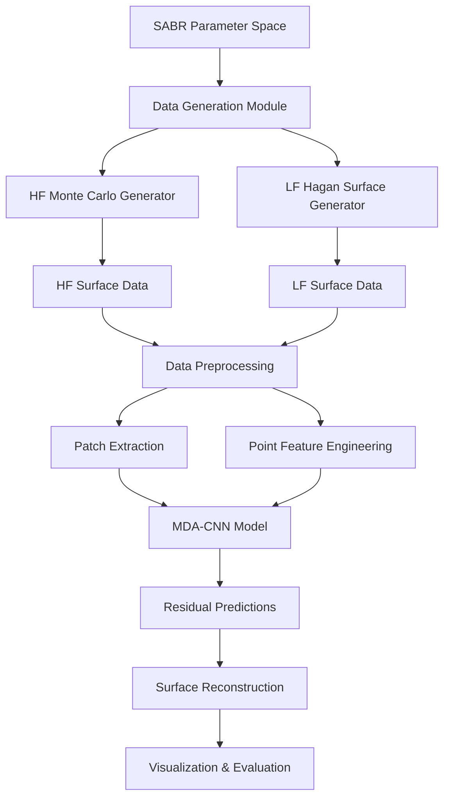

# Design Document

## Overview

The SABR Volatility Surface MDA-CNN system is designed as a multi-fidelity machine learning framework that leverages both high-fidelity Monte Carlo simulations and low-fidelity Hagan analytical approximations to predict volatility surfaces with minimal expensive computational resources. The system follows a residual mapping approach, where the MDA-CNN learns to predict the difference between MC and Hagan surfaces rather than absolute volatility values.

The entire project will be organized in a new "new/" directory to provide a clean separation from legacy implementations.

## Architecture

### System Architecture Overview



### Data Flow Architecture

1. **Parameter Sampling**: Generate comprehensive SABR parameter combinations (F0, alpha, beta, nu, rho, K, T)
2. **Surface Generation**: Create both HF MC and LF Hagan surfaces for each parameter set
3. **Patch Extraction**: Extract local surface patches around each HF point for CNN input
4. **Feature Engineering**: Create normalized point features for MLP input
5. **Model Training**: Train MDA-CNN to predict residuals D(ξ) = σ_MC(ξ) - σ_Hagan(ξ)
6. **Inference**: Combine LF predictions with learned residuals for final surface reconstruction

## Components and Interfaces

### 1. Data Generation Module (`new/data_generation/`)

**Purpose**: Generate comprehensive SABR volatility surface datasets

**Key Components**:
- `sabr_mc_generator.py`: Monte Carlo simulation engine
- `hagan_surface_generator.py`: Analytical Hagan formula implementation
- `parameter_sampler.py`: Strategic parameter space sampling
- `data_validator.py`: Data quality checks and outlier detection

**Interfaces**:
```python
class SABRDataGenerator:
    def generate_mc_surface(self, params: SABRParams, grid_config: GridConfig) -> np.ndarray
    def generate_hagan_surface(self, params: SABRParams, grid_config: GridConfig) -> np.ndarray
    def sample_parameter_space(self, n_samples: int, strategy: str) -> List[SABRParams]
    def validate_surface_data(self, surface_data: np.ndarray) -> bool
```

### 2. Model Architecture Module (`new/models/`)

**Purpose**: Implement MDA-CNN and baseline models

**Key Components**:
- `mda_cnn.py`: Main MDA-CNN architecture
- `baseline_models.py`: MLP baselines for comparison
- `model_utils.py`: Common utilities and layers
- `loss_functions.py`: Custom loss functions and metrics

**MDA-CNN Architecture**:
```python
class MDACNN(tf.keras.Model):
    def __init__(self, patch_size=(9,9), n_point_features=8):
        # CNN Branch for LF patches
        self.conv_stack = [
            Conv2D(32, 3, activation='relu', padding='same'),
            Conv2D(64, 3, activation='relu', padding='same'), 
            Conv2D(128, 3, activation='relu', padding='same'),
            GlobalAveragePooling2D(),
            Dense(128, activation='relu')
        ]
        
        # MLP Branch for point features
        self.point_mlp = [
            Dense(64, activation='relu'),
            Dense(64, activation='relu')
        ]
        
        # Fusion head
        self.fusion_head = [
            Dense(128, activation='relu'),
            Dropout(0.2),
            Dense(64, activation='relu'),
            Dense(1, activation='linear')  # Residual output
        ]
```

### 3. Data Processing Module (`new/preprocessing/`)

**Purpose**: Handle data preprocessing, patch extraction, and feature engineering

**Key Components**:
- `patch_extractor.py`: Extract local surface patches around HF points
- `feature_engineer.py`: Create and normalize point features
- `data_loader.py`: Efficient data loading and batching
- `normalization.py`: Data normalization and scaling utilities

**Interfaces**:
```python
class PatchExtractor:
    def extract_patch(self, surface: np.ndarray, center_idx: Tuple[int, int], 
                     patch_size: Tuple[int, int]) -> np.ndarray
    def align_hf_to_grid(self, hf_points: np.ndarray, grid_config: GridConfig) -> List[Tuple[int, int]]

class FeatureEngineer:
    def create_point_features(self, sabr_params: SABRParams, strike: float, 
                            maturity: float, hagan_vol: float) -> np.ndarray
    def normalize_features(self, features: np.ndarray) -> np.ndarray
```

### 4. Training Module (`new/training/`)

**Purpose**: Handle model training, validation, and hyperparameter optimization

**Key Components**:
- `trainer.py`: Main training orchestrator
- `experiment_config.py`: Configuration management
- `callbacks.py`: Custom training callbacks
- `hyperparameter_tuning.py`: Automated hyperparameter search

**Training Pipeline**:
```python
class ModelTrainer:
    def train_model(self, model: tf.keras.Model, train_data: Dataset, 
                   val_data: Dataset, config: TrainingConfig) -> History
    def evaluate_model(self, model: tf.keras.Model, test_data: Dataset) -> Dict[str, float]
    def run_ablation_study(self, base_config: TrainingConfig) -> Dict[str, Results]
```

### 5. Evaluation Module (`new/evaluation/`)

**Purpose**: Comprehensive model evaluation and performance analysis

**Key Components**:
- `metrics.py`: Custom evaluation metrics
- `surface_evaluator.py`: Surface-specific evaluation logic
- `benchmark_comparison.py`: Compare against baselines
- `statistical_analysis.py`: Statistical significance testing

**Evaluation Metrics**:
- RMSE/MAE for overall surface accuracy
- Relative error percentages
- ATM/ITM/OTM region-specific metrics
- Wing performance analysis
- Computational efficiency metrics

### 6. Visualization Module (`new/visualization/`)

**Purpose**: Generate comprehensive plots and analysis visualizations

**Key Components**:
- `surface_plotter.py`: 3D surface visualization
- `smile_plotter.py`: Volatility smile comparisons
- `performance_plotter.py`: Training curves and performance analysis
- `error_analysis.py`: Error distribution and residual analysis

**Key Visualizations**:
- Volatility smile comparisons (HF, LF, baseline, MDA-CNN)
- 3D surface plots with error heatmaps
- Performance vs HF budget curves
- Residual distribution histograms
- Training convergence plots

## Data Models

### Core Data Structures

```python
@dataclass
class SABRParams:
    F0: float      # Forward price
    alpha: float   # Initial volatility
    beta: float    # Elasticity parameter [0,1]
    nu: float      # Vol-of-vol parameter
    rho: float     # Correlation parameter [-1,1]

@dataclass
class GridConfig:
    strike_range: Tuple[float, float]
    maturity_range: Tuple[float, float]
    n_strikes: int
    n_maturities: int
    
@dataclass
class SurfaceData:
    parameters: SABRParams
    strikes: np.ndarray
    maturities: np.ndarray
    hf_surface: np.ndarray  # MC volatilities
    lf_surface: np.ndarray  # Hagan volatilities
    residuals: np.ndarray   # HF - LF
    
@dataclass
class TrainingConfig:
    batch_size: int = 64
    epochs: int = 200
    learning_rate: float = 3e-4
    patch_size: Tuple[int, int] = (9, 9)
    hf_budget: int = 200
    validation_split: float = 0.15
```

### Database Schema (File-based Storage)

```
new/data/
├── raw/
│   ├── hf_surfaces/          # High-fidelity MC surfaces
│   │   ├── surface_001.pkl
│   │   └── ...
│   ├── lf_surfaces/          # Low-fidelity Hagan surfaces  
│   │   ├── surface_001.pkl
│   │   └── ...
│   └── parameters/           # SABR parameter sets
│       └── param_sets.csv
├── processed/
│   ├── training_patches.h5   # Preprocessed patch data
│   ├── point_features.h5     # Normalized point features
│   └── residual_targets.h5   # Target residuals
└── splits/
    ├── train_indices.npy
    ├── val_indices.npy
    └── test_indices.npy
```

## Error Handling

### Data Generation Errors
- **MC Convergence Issues**: Implement convergence checks and adaptive path counts
- **Parameter Validation**: Validate SABR parameters are within reasonable bounds
- **Numerical Instability**: Handle edge cases in Hagan formula evaluation
- **Memory Management**: Implement chunked processing for large surface grids

### Model Training Errors
- **Gradient Explosion**: Implement gradient clipping and learning rate scheduling
- **Overfitting**: Early stopping, dropout, and L2 regularization
- **Data Loading**: Robust error handling for corrupted or missing data files
- **GPU Memory**: Automatic batch size reduction on OOM errors

### Evaluation Errors
- **Missing Baselines**: Graceful degradation when baseline models unavailable
- **Visualization Failures**: Fallback to simpler plots when complex visualizations fail
- **Statistical Tests**: Handle cases with insufficient data for significance testing

## Testing Strategy

### Unit Testing
- **Data Generation**: Test MC convergence, Hagan formula accuracy, parameter sampling
- **Model Components**: Test individual CNN/MLP components, loss functions, metrics
- **Preprocessing**: Test patch extraction, feature normalization, data loading
- **Utilities**: Test helper functions, configuration parsing, file I/O

### Integration Testing
- **End-to-End Pipeline**: Test complete data generation → training → evaluation flow
- **Model Training**: Test training loop with small datasets
- **Visualization**: Test plot generation with sample data
- **Configuration**: Test different configuration combinations

### Performance Testing
- **Scalability**: Test with varying dataset sizes and model complexities
- **Memory Usage**: Profile memory consumption during training and inference
- **GPU Utilization**: Monitor GPU usage and identify bottlenecks
- **Computational Efficiency**: Compare runtime against baseline implementations

### Validation Testing
- **Financial Accuracy**: Validate against known SABR analytical solutions
- **Numerical Stability**: Test with extreme parameter values
- **Convergence**: Verify model training converges reliably
- **Reproducibility**: Ensure consistent results across runs with fixed seeds

## Implementation Phases

### Phase 1: Foundation (Data Generation)
1. Set up project structure in `new/` directory
2. Implement SABR Monte Carlo simulation engine
3. Implement Hagan analytical surface generator
4. Create parameter sampling strategies
5. Implement data validation and quality checks

### Phase 2: Model Architecture
1. Implement MDA-CNN architecture
2. Create baseline MLP models
3. Implement patch extraction and feature engineering
4. Create data loading and preprocessing pipeline

### Phase 3: Training Infrastructure
1. Implement training loop with proper validation
2. Create experiment configuration system
3. Implement model checkpointing and logging
4. Add hyperparameter tuning capabilities

### Phase 4: Evaluation and Visualization
1. Implement comprehensive evaluation metrics
2. Create visualization tools for surfaces and performance
3. Add statistical analysis and significance testing
4. Create automated reporting system

### Phase 5: Optimization and Deployment
1. Optimize computational performance
2. Add GPU acceleration where beneficial
3. Implement parallel processing for data generation
4. Create user-friendly interfaces and documentation